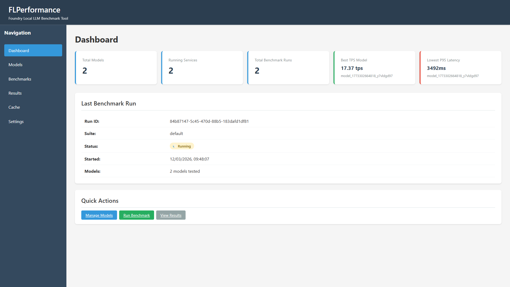
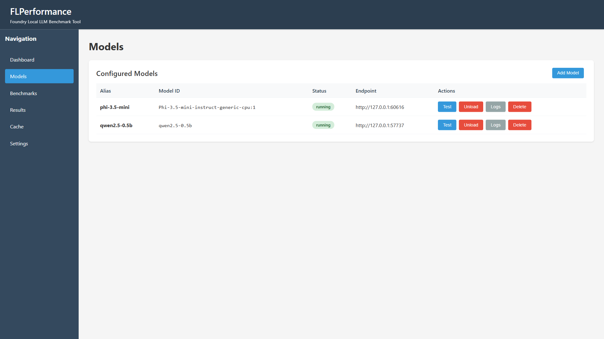
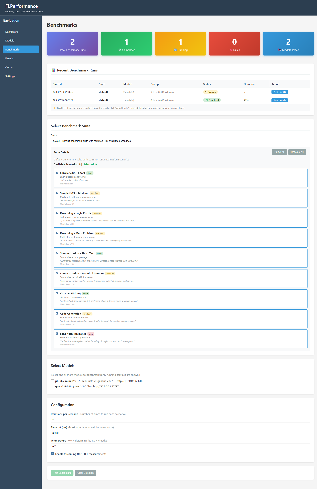
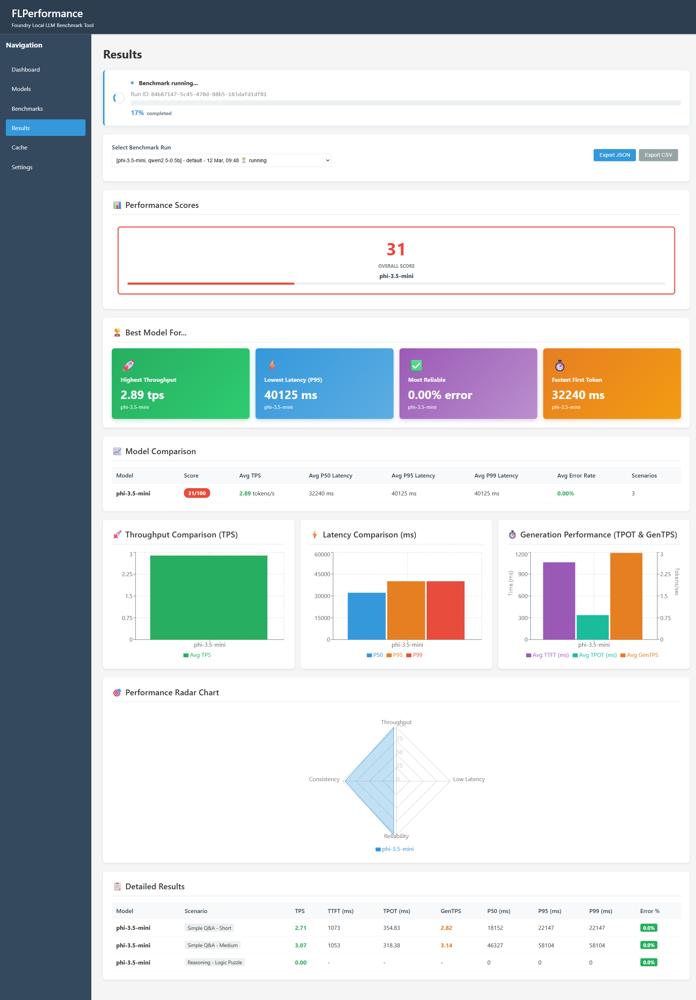
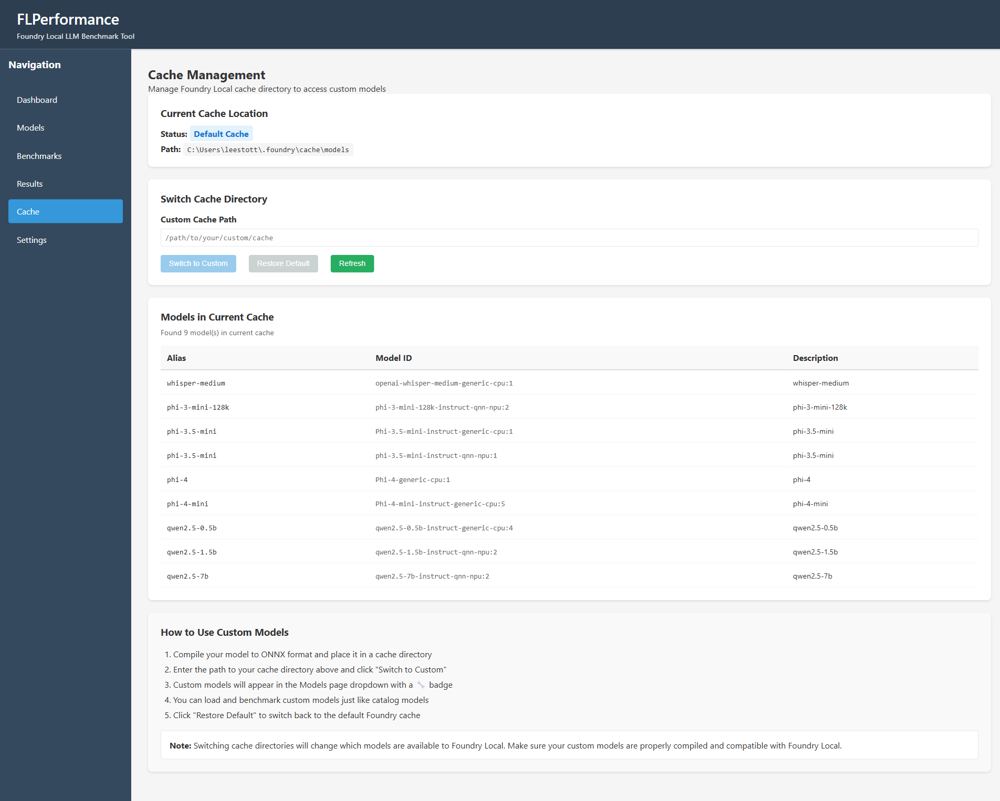
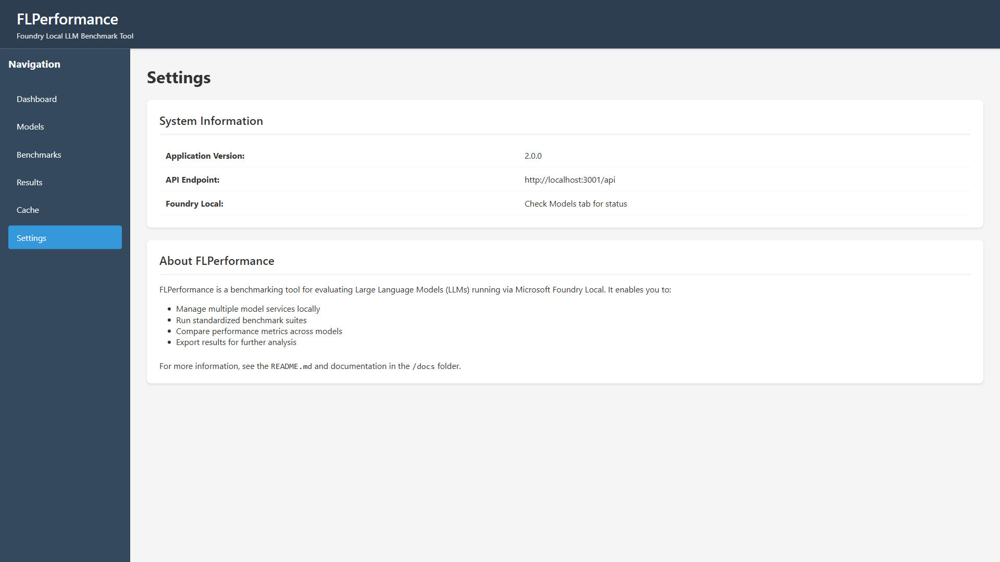

# FLPerformance: Foundry Local Model Benchmark Tool

A local application with a web UI for benchmarking multiple small language models (SLMs) running via **Microsoft Foundry Local**.

**[Read the full story: How we built FLPerformance](BLOGPOST.md)** to learn about the architecture decisions, challenges faced, and how to obtain real-world LLM performance metrics on your local hardware.

## Easy Startup Script

**Windows users**: If you have Node.js installed, run `.\START_APP.ps1` to start everything. This opens two terminals and opens the browser automatically.

### Features
- **Complete Benchmark System**: Full end-to-end benchmarking with accurate metrics
- **Enhanced Visualisations**: Performance cards, comparison charts, and radar graphs
- **Non-blocking Model Loading**: Models download and load in the background with real-time status polling
- **Real-time Progress**: Polling-based status updates every two seconds during runs
- **Pre-test Validation**: Test button to verify model inference before benchmarking
- **Results Export**: JSON and CSV export functionality
- **Hardware Detection**: Comprehensive system information capture
- **Storage System**: JSON-based storage with optional SQLite support
- **Custom Cache Support**: Switch between model cache directories via the Cache tab
- **Multi-Model Comparison**: Side-by-side performance analysis with visual insights

## Overview

FLPerformance enables you to:
- Manage the Foundry Local service using the official JavaScript SDK
- Load and benchmark multiple models simultaneously
- Run standardised benchmark tests across models
- Display clear performance statistics with tables and charts
- Export results for analysis


*Dashboard showing system status, benchmark run history, and quick actions*


*Models page for loading, testing, and managing AI models*


*Benchmarks page with suite selection, model selection, and configuration*


*Comprehensive results with performance scores, comparison charts, and detailed metrics*


*Cache management page for switching model directories and viewing cached models*


*Settings page with system information, API endpoint, and application details*

## Quick Start

### Before You Begin

**Required: Install Microsoft Foundry Local first**
```powershell
# Windows
winget install Microsoft.FoundryLocal

# macOS
brew tap microsoft/foundrylocal
brew install foundrylocal

# Or download from: https://aka.ms/foundry-local-installer
```

Verify installation:
```bash
foundry --version
```

### Installation (3 Steps)

**Step 1: Navigate to project directory**
```powershell
cd C:\Users\YourUsername\path\to\FLPerformance
```

**Step 2: Install Node.js (if not already installed)**

```powershell
# Windows - Install Node.js LTS
winget install --id OpenJS.NodeJS.LTS --accept-package-agreements --accept-source-agreements

# After installation, RESTART YOUR TERMINAL for PATH updates
```

**macOS:**
```bash
brew install node
```

Or download from: https://nodejs.org/

**Step 3: Run installation script**

```powershell
# Windows 
.\scripts\install.ps1

# macOS/Linux
chmod +x scripts/install.sh && ./scripts/install.sh
```

**Note**: Installation uses `--no-optional` flag to skip SQLite database (requires build tools).  
Results are saved as JSON files instead. This works perfectly for all features!

**Step 4: Start the application**
```powershell
# Easy Mode - Opens 2 terminals + browser automatically (Windows)
.\START_APP.ps1

# Manual Mode - Starts both servers
npm run dev
```

### Access the Application

Once the server starts, open your browser:

**http://localhost:3000**

You will see:
- **Models** tab: Add and load AI models
- **Benchmarks** tab: Run performance tests
- **Results** tab: View comparison charts
- **Cache** tab: Switch to custom model cache directories

### First Time Setup (In the UI)

1. Click **Models**, then **Initialise Foundry Local** (one-time setup)
2. Click **Add Model** and select `phi-3-mini-4k-instruct`
3. Click **Load Model** (downloads roughly 2 GB; the model loads in the background while you see real-time status)
4. Go to **Benchmarks**, select your model, and click **Run Benchmark**
5. View results in the **Results** tab

### Custom Models (Optional)
- Use the **Cache** tab to switch the Foundry cache directory
- Point to directories containing custom ONNX models
- Custom models appear in the Models dropdown with a wrench badge
- Benchmark custom models in the same way as catalogue models

---

## Alternative: Manual Installation

If the automated installation script does not work, follow these manual steps:

### Required Software

1. **Microsoft Foundry Local**
   - Download from: https://aka.ms/foundry-local-installer
   - Verify installation: `foundry --version`
   - **Note**: Foundry Local CLI must be in your PATH

2. **Node.js & NPM**
   - Node.js v18 or higher
   - NPM v9 or higher
   - Download from: https://nodejs.org/
   - Verify: `node --version` and `npm --version`

3. **System Requirements**
   - Windows 10/11, macOS, or Linux
   - Minimum 16GB RAM (32GB+ recommended for multiple models)
   - GPU with CUDA support (optional but recommended)
   - Adequate disk space for model storage (varies by model, typically 5-50GB per model)

### Installation Steps

#### 1. Install Dependencies

```bash
# Skip optional SQLite (requires build tools)
npm install --no-optional

# Install frontend dependencies
cd src/client
npm install
cd ../..

# Create results directory
mkdir results
```

**Want SQLite database support?** Install Visual Studio Build Tools first:
```powershell
# Windows only - needed for better-sqlite3
winget install Microsoft.VisualStudio.2022.BuildTools --silent --override "--wait --passive --add Microsoft.VisualStudio.Workload.VCTools"

# Then install with optional dependencies
npm install

# Create results directory
mkdir results
```

#### 2. Start the Application

```bash
# Development mode (with hot reload)
npm run dev
```

**Access the application at: http://localhost:3000**

The application will be available at:
- **Frontend UI**: http://localhost:3000
- **Backend API**: http://localhost:3001

---

## Using the Application

1. Open the UI at http://localhost:3000
2. Navigate to the **Models** tab
3. Click **Initialise Foundry Local** to start the service
4. Click **Add Model**
5. Select a model from the available Foundry Local catalogue (for example, `phi-3-mini-4k-instruct`)
6. Click **Load Model** to download (if needed) and load the model into memory

**Note**: Foundry Local uses a single service instance that can load multiple models simultaneously. Models are differentiated by their model ID when making inference requests.

### 4. Run Your First Benchmark

1. Navigate to the **Benchmarks** tab
2. Select the **default** benchmark suite
3. Choose one or more models to benchmark
4. Configure settings (iterations, concurrency, and so on)
5. Click **Run Benchmark**
6. Watch live progress as tests execute

### Viewing Results

1. Navigate to the **Results** tab
2. View comparison tables and charts
3. Filter by run, model, or benchmark type
4. Export results as JSON or CSV

---

## Project Structure

```
FLPerformance/
├── src/
│   ├── server/              # Backend API
│   │   ├── index.js         # Express server entry point
│   │   ├── orchestrator.js  # Foundry Local service orchestration
│   │   ├── benchmark.js     # Benchmark engine
│   │   ├── cacheManager.js  # Model cache management (filesystem-based)
│   │   ├── storage.js       # Results storage (JSON + SQLite)
│   │   └── logger.js        # Structured logging
│   └── client/              # Frontend UI (React + Vite)
│       └── src/
│           ├── pages/       # Page views
│           └── utils/       # Client utilities
├── benchmarks/
│   └── suites/
│       └── default.json     # Default benchmark suite definition
├── docs/
│   ├── architecture.md      # System architecture
│   ├── api.md               # REST API reference
│   ├── setup.md             # Setup documentation
│   ├── BENCHMARK_GUIDE.md   # Troubleshooting guide
│   ├── QUICK_REFERENCE.md   # Commands and code patterns cheat sheet
│   ├── TESTING_CHECKLIST.md # Comprehensive test cases
│   ├── VALIDATION_STEPS.md  # Validation procedures
│   └── images/              # Screenshots and diagrams
├── scripts/
│   └── helpers/            # Utility scripts
├── results/
│   └── example/            # Example benchmark results
├── package.json
└── README.md
```

## Key Features

### Model & Service Management
- Unified service management using foundry-local-sdk
- Add/remove models from Foundry Local catalog
- Load multiple models simultaneously in a single service
- **Custom Model Support**: Benchmark custom ONNX models from alternate cache directories via Cache tab
- Monitor model health and status in real-time
- Automatic model download and caching

### Benchmark Suite
- **Throughput (TPS)**: Tokens generated per second (overall)
- **Latency**: Time to first token (TTFT), time per output token (TPOT), and end-to-end completion time
- **Generation Speed (GenTPS)**: Token generation rate after first token (1000/TPOT)
- **Percentile Metrics**: P50, P95, and P99 latency measurements for reliability analysis
- **Performance Scoring**: 0-100 score based on throughput, latency, and reliability
- **Stability**: Error rate and timeout tracking
- **Resource Usage**: CPU, RAM, and GPU utilisation (platform-dependent)

### Results & Comparison
- **Performance Score Cards**: Visual 0-100 ratings for each model
- **"Best Model For..." Cards**: Automatic recommendations for throughput, latency, reliability, and TTFT
- **Side-by-side Comparison Table**: Detailed metrics with colour-coded scores
- **Interactive Charts**: 
  - Throughput comparison (TPS)
  - Latency comparison (P50/P95/P99)
  - Generation performance (TTFT, TPOT, GenTPS)
  - Performance radar chart showing multidimensional analysis
- **Detailed Results Table**: Per-scenario breakdowns with all metrics
- **Export Options**: JSON and CSV export for further analysis

## Configuration

Default settings can be modified in the **Settings** tab:
- Default iterations per benchmark
- Concurrency level
- Request timeout values
- Results storage path
- Streaming mode (if supported)

## Architecture

FLPerformance uses the official **foundry-local-sdk** JavaScript package to manage the Foundry Local service:

- **Single Service Instance**: One Foundry Local service handles all models
- **Multiple Loaded Models**: Models are loaded on-demand and run simultaneously
- **OpenAI-Compatible API**: Standard OpenAI client for inference requests
- **Model Differentiation**: Models are identified by their model ID in API calls

See [Architecture Documentation](docs/architecture.md) for details.

## Troubleshooting

### Service fails to start
- Ensure Foundry Local is installed: `foundry --version`
- Verify Foundry Local CLI is in your PATH
- Check that port 8080 is available (default Foundry Local port)
- View logs in the **Models** tab for specific error messages

### Model fails to load
- Verify sufficient disk space for model download
- Check network connectivity for first-time downloads
- Ensure adequate RAM for model size
- Try manually loading with Foundry Local CLI: `foundry model run <model-name>`

### Benchmark timeouts
- Increase timeout values in Settings
- Reduce concurrency level
- Check system resource availability (RAM, GPU memory)

### Test Models Before Benchmarking
- Use the **Test** button in the Models tab to verify inference works
- Successful test ensures model will work in benchmarks
- Test validates both model loading and inference response
- Quick way to catch configuration issues early

### Installation Issues
- Run the appropriate installation script (install.ps1 or install.sh) for detailed diagnostics
- Check [Quick Start Guide](QUICK_START.md) for common installation issues
- Verify Node.js version: `node --version` (must be v18+)

## Documentation

For more detailed information, see:
- [Quick Start Guide](QUICK_START.md) - Comprehensive getting started guide
- [Quick Reference](docs/QUICK_REFERENCE.md) - Commands and code patterns cheat sheet
- [Architecture Documentation](docs/architecture.md) - System design and SDK integration
- [API Reference](docs/api.md) - REST API endpoint documentation
- [Setup Guide](docs/setup.md) - Detailed installation and configuration
- [Benchmark Guide](docs/BENCHMARK_GUIDE.md) - Troubleshooting and testing guide
- [Testing Checklist](docs/TESTING_CHECKLIST.md) - Comprehensive test cases

## Resources

- [Microsoft Foundry Local](https://aka.ms/foundry-local-docs)
- [Foundry Local GitHub](https://github.com/microsoft/foundry-local)
- [Foundry Local SDK (npm)](https://www.npmjs.com/package/foundry-local-sdk)

## Support

For issues or questions:
1. Check the documentation in `/docs`
2. Review logs in the UI under each service
3. Examine results in `/results` directory

## License

MIT License
